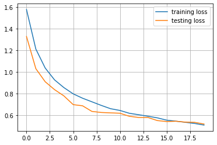
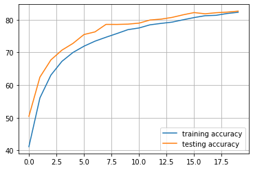

# CIFAR10


```python
import torch.nn as nn
import torch.optim as optim
from torchvision import transforms
import matplotlib.pyplot as plt

from src.data import CIFAR10
from src.models import CNN
from src.training.config import TrainingConfig
from src.training import ModelTrainer
```


```python
training_config = TrainingConfig(batch_size=100, lr=0.001)
```


```python
training_transform = transforms.Compose([
    transforms.Resize((32,32)),
    transforms.RandomHorizontalFlip(),
    transforms.RandomRotation(degrees=10),
    transforms.RandomAffine(degrees=0, shear=10, scale=(0.8, 1.2)),
    transforms.ColorJitter(brightness=0.2, contrast=0.2, saturation=0.2),
    transforms.ToTensor(),
    transforms.Normalize((0.4914, 0.4822, 0.4465), (0.2023, 0.1994, 0.2010))
])

validation_transform = transforms.Compose([
    transforms.Resize((32,32)),
    transforms.ToTensor(),
    transforms.Normalize((0.4914, 0.4822, 0.4465), (0.2023, 0.1994, 0.2010))
])
```


```python
training_data = CIFAR10(train=True, root='./data', transform=training_transform)
testing_data = CIFAR10(train=False, root='./data', transform=validation_transform)
```

    Files already downloaded and verified
    Files already downloaded and verified
    


```python
len(training_data), len(testing_data)
```


    (50000, 10000)


```python
model = CNN()
```


```python
model
```


    CNN(
      (network): Sequential(
        (0): Conv2d(3, 32, kernel_size=(3, 3), stride=(1, 1), padding=(1, 1))
        (1): BatchNorm2d(32, eps=1e-05, momentum=0.1, affine=True, track_running_stats=True)
        (2): ReLU()
        (3): Conv2d(32, 64, kernel_size=(3, 3), stride=(1, 1), padding=(1, 1))
        (4): ReLU()
        (5): MaxPool2d(kernel_size=(2, 2), stride=(2, 2), padding=0, dilation=1, ceil_mode=False)
        (6): Conv2d(64, 128, kernel_size=(3, 3), stride=(1, 1), padding=(1, 1))
        (7): BatchNorm2d(128, eps=1e-05, momentum=0.1, affine=True, track_running_stats=True)
        (8): ReLU()
        (9): Conv2d(128, 128, kernel_size=(3, 3), stride=(1, 1), padding=(1, 1))
        (10): ReLU()
        (11): MaxPool2d(kernel_size=(2, 2), stride=(2, 2), padding=0, dilation=1, ceil_mode=False)
        (12): Dropout2d(p=0.05, inplace=False)
        (13): Conv2d(128, 256, kernel_size=(3, 3), stride=(1, 1), padding=(1, 1))
        (14): BatchNorm2d(256, eps=1e-05, momentum=0.1, affine=True, track_running_stats=True)
        (15): ReLU()
        (16): Conv2d(256, 256, kernel_size=(3, 3), stride=(1, 1), padding=(1, 1))
        (17): ReLU()
        (18): MaxPool2d(kernel_size=(2, 2), stride=(2, 2), padding=0, dilation=1, ceil_mode=False)
        (19): Flatten(start_dim=1, end_dim=-1)
        (20): Linear(in_features=4096, out_features=1024, bias=True)
        (21): ReLU()
        (22): Dropout(p=0.1, inplace=False)
        (23): Linear(in_features=1024, out_features=512, bias=True)
        (24): ReLU()
        (25): Dropout(p=0.1, inplace=False)
        (26): Linear(in_features=512, out_features=10, bias=True)
      )
    )


```python
model_trainer = ModelTrainer(
    model,
    optim.Adam,
    nn.CrossEntropyLoss(),
    training_config,
    training_data,
    cuda=True,
    validation_data=testing_data
)
```

    using NVIDIA GeForce GTX 1060
    


```python
training_metrics, testing_metrics = model_trainer.train(20, True)
```

    C:\Users\raghu\anaconda3\envs\CV\lib\site-packages\torch\nn\functional.py:718: UserWarning: Named tensors and all their associated APIs are an experimental feature and subject to change. Please do not use them for anything important until they are released as stable. (Triggered internally at  ..\c10/core/TensorImpl.h:1156.)
      return torch.max_pool2d(input, kernel_size, stride, padding, dilation, ceil_mode)
    

    training metrics:   epoch: 0            loss: 1.5784082419872283      accuracy: 41.126              
    testing metrics:    epoch: 0            loss: 1.3292375528812408      accuracy: 50.41               
    training metrics:   epoch: 1            loss: 1.212923968911171       accuracy: 56.058              
    testing metrics:    epoch: 1            loss: 1.0316443246603013      accuracy: 62.43               
    training metrics:   epoch: 2            loss: 1.0380217546224595      accuracy: 63.062              
    testing metrics:    epoch: 2            loss: 0.9110818833112717      accuracy: 67.71               
    training metrics:   epoch: 3            loss: 0.928508181810379       accuracy: 67.266              
    testing metrics:    epoch: 3            loss: 0.8383302247524261      accuracy: 70.7                
    training metrics:   epoch: 4            loss: 0.8570786463022232      accuracy: 69.978              
    testing metrics:    epoch: 4            loss: 0.7804780745506287      accuracy: 72.76               
    training metrics:   epoch: 5            loss: 0.799028912127018       accuracy: 71.902              
    testing metrics:    epoch: 5            loss: 0.6994685316085816      accuracy: 75.48               
    training metrics:   epoch: 6            loss: 0.75893344694376        accuracy: 73.444              
    testing metrics:    epoch: 6            loss: 0.6888621127605439      accuracy: 76.29               
    training metrics:   epoch: 7            loss: 0.7257878994941711      accuracy: 74.65               
    testing metrics:    epoch: 7            loss: 0.6369567197561264      accuracy: 78.59               
    training metrics:   epoch: 8            loss: 0.6925451025366783      accuracy: 75.794              
    testing metrics:    epoch: 8            loss: 0.627204647064209       accuracy: 78.58               
    training metrics:   epoch: 9            loss: 0.6619128522276878      accuracy: 76.982              
    testing metrics:    epoch: 9            loss: 0.6235260540246963      accuracy: 78.67               
    training metrics:   epoch: 10           loss: 0.64592421656847        accuracy: 77.49               
    testing metrics:    epoch: 10           loss: 0.6201305136084556      accuracy: 78.97               
    training metrics:   epoch: 11           loss: 0.619891868174076       accuracy: 78.46               
    testing metrics:    epoch: 11           loss: 0.5919953605532646      accuracy: 79.93               
    training metrics:   epoch: 12           loss: 0.606470261335373       accuracy: 78.89               
    testing metrics:    epoch: 12           loss: 0.5808182695508003      accuracy: 80.2                
    training metrics:   epoch: 13           loss: 0.5923363217115403      accuracy: 79.284              
    testing metrics:    epoch: 13           loss: 0.580881395637989       accuracy: 80.73               
    training metrics:   epoch: 14           loss: 0.5774972190260887      accuracy: 79.994              
    testing metrics:    epoch: 14           loss: 0.5523303392529487      accuracy: 81.52               
    training metrics:   epoch: 15           loss: 0.5560871375799179      accuracy: 80.676              
    testing metrics:    epoch: 15           loss: 0.5432409384846687      accuracy: 82.21               
    training metrics:   epoch: 16           loss: 0.5467971447706222      accuracy: 81.246              
    testing metrics:    epoch: 16           loss: 0.5461860287189484      accuracy: 81.84               
    training metrics:   epoch: 17           loss: 0.5363432710766792      accuracy: 81.37               
    testing metrics:    epoch: 17           loss: 0.5380523410439492      accuracy: 82.16               
    training metrics:   epoch: 18           loss: 0.5253701380491257      accuracy: 81.926              
    testing metrics:    epoch: 18           loss: 0.5359798032045364      accuracy: 82.35               
    training metrics:   epoch: 19           loss: 0.5107552931308746      accuracy: 82.294              
    testing metrics:    epoch: 19           loss: 0.5203717079758644      accuracy: 82.65               
    


```python
plt.figure(facecolor='white')
plt.plot(training_metrics.losses, label='training loss')
plt.plot(testing_metrics.losses, label='testing loss')
plt.grid()
plt.legend()
```


    <matplotlib.legend.Legend at 0x2f49550bd60>


    

    


```python
plt.figure(facecolor='white')
plt.plot(training_metrics.accuracies, label='training accuracy')
plt.plot(testing_metrics.accuracies, label='testing accuracy')
plt.grid()
plt.legend()
```


    <matplotlib.legend.Legend at 0x2f48836bc40>


    

    


```python

```
